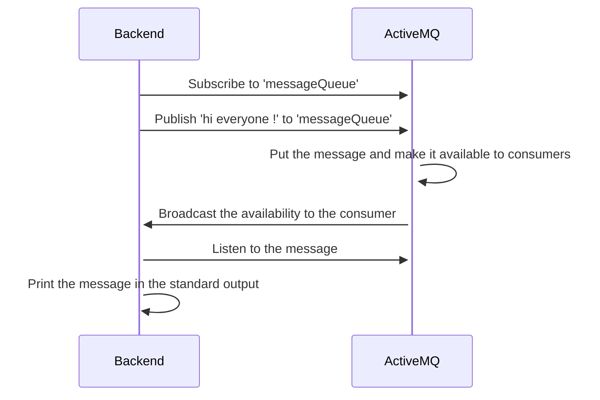

# spring-boot-activemq

## Tools needed

You need Docker with the compose plugin.

## Usage

Launch the ActiveMQ and the spring boot app with docker

```shell
docker compose up --build -d
```

Then you can try with these endpoints :
- http://localhost:8080/actuator/health (Should return `{"status":"UP"}`)
- http://localhost:8080/message/sayHello (Should print `Hi everyone !` inside the standard output of the container)



You can display the standard output of the backend with

```shell
docker logs spring-app-1 -f
```